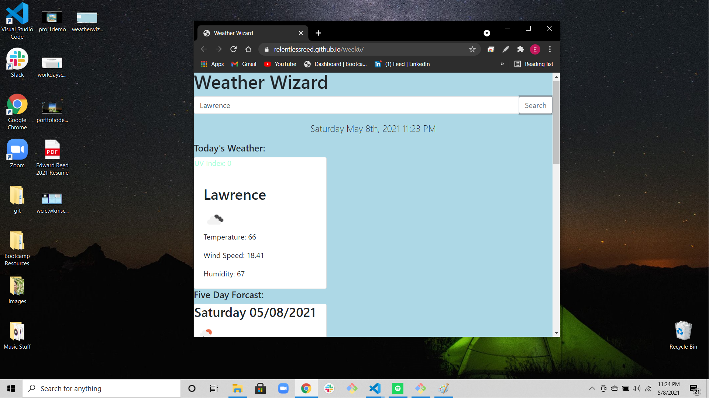

# week5 Weather Dashboard

<h1>Weather Wizard</h1>
A simple weather forecast application. When you search a city, you will see listed in the main card your current weather, a color coded UV index based on the favorability of the current conditions, and a five day forecast for the week. Upon page refresh you will see all the previously searched cities at the bottom of the page. If you click on any of the previous search buttons, the weather + five day forcast for clicked city will populate the page. Hitting clear results removes all previous search history.

[Link to deployable application](https://relentlessreed.github.io/week6/)

[Email Me: relentlessreed@gmail.com](mailto:relentlessreed@gmail.com?subject=GitHub)
